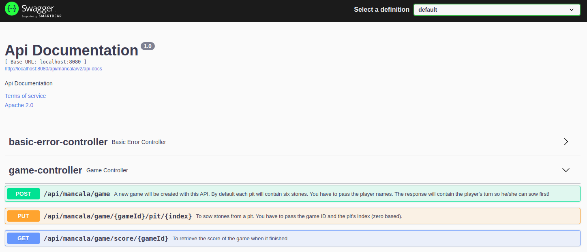
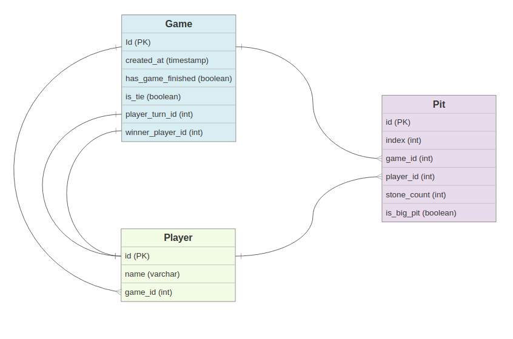

# Mancala game:  

**What is it:**
- You can find in below link, what Mancala is, and it's rules:
  https://www.thesprucecrafts.com/mancala-411837

**What technologies/libraries used:**

- Java 8, Spring boot, Spring cloud, MapStruct, Swagger-UI, H2 DB, JUnit 5.

**How the source code is packaged:**
- `io.nassar.game.mancala`: _Parent package for all below._ 
  - `.config`: _Contains configuration classes._ 
  - `.controller`: _Contains API related classes (rest controllers, controller advisors, ...)._ 
  - `.domain`: _Contains the domain/entity classes._  
  - `.dto`: _Contains the request/response DTOs/POJOs and their mappers (domain <-> DTO)._
  - `.exception`: _Contains the custom exception classes._
  - `.repository`: _Contains the repositories interfaces._
  - `.service`: _Contains service/business classes._
  - `MancalaAPIApplication`: _Represents the driver/main class of this project._

**How to run the game:**

- Clone the repository: `git clone https://gitlab.com/bolcom/omar-nassar.git`
- Go into directory: `cd omar-nassar`
- Checkout develop branch: `git checkout develop`
- Building the project: `mvn clean install`
- Go into executable directory: `cd target`
- Running the application: `java -jar mancala-0.0.1-SNAPSHOT.jar`
  - By default, the game is running on port 8080. But, you can change it using the below command:
      - `java -Dserver.port=<YOUR-PREFERED-PORT> -jar mancala-0.0.1-SNAPSHOT.jar`
  - At this stage, the game is running! You can access the Swagger using the below link:
    - `http://localhost:8080/api/mancala/swagger-ui/index.html`  
       
  

**How to access the database:**  
- URL: http://localhost:8080/api/mancala/h2-console
  using below configurations:
  - Driver class: `org.h2.Driver`
  - JDBC URL: `jdbc:h2:mem:mancala-db`
  - User Name: `sa`
  - Password: `password`
- ER Diagram:  

**How to play:**

- Using the POST method (in Green), specify the first & second player names.
    - The game will specify one of those players (randomly) to start sowing. 
- By reviewing the `playerTurn` from the response (when creating the game),   that player can select one of his/her pit's index (zero based). 
  - e.g. if the `playerTurn` is player 1, he/she can select (0, 1, 2, 3, 4, 5) index to sow from.
- Using the PUT method (in Orange), specify `gameId` and pit `index` to start sowing.
    - Both players will keep using this API until the end!
    - When the response of `hasGameFinished` equals to true, this means the game has finished.
- To determine the score of the game, you can pass the `gameId` to the GET method (in Blue).
    - The response of this API, tells the winner & the looser and their score. Also, a tie in case of.

**Enjoy :)**